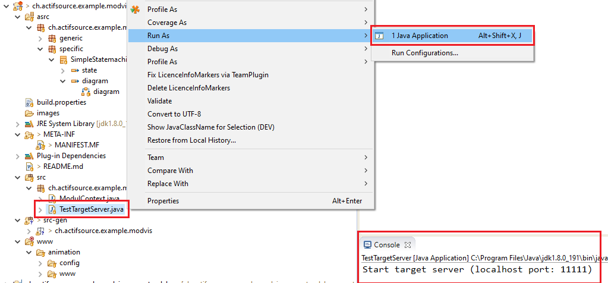
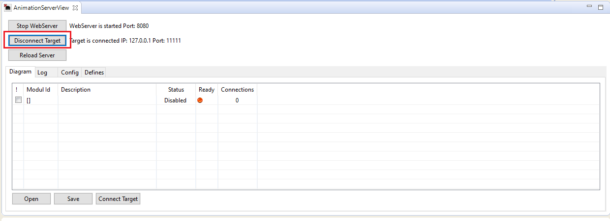
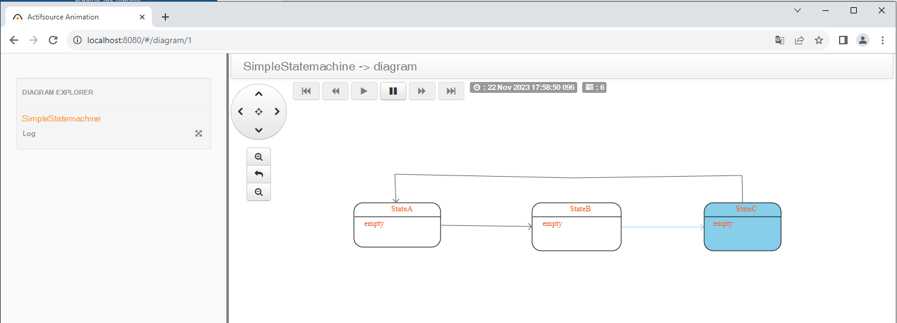

# Modvis example

This is a simple self-contained example to animate a state machine.

To run this example, the target symulator must be started first.

The AnimationServer view (Windows->Show View->Others->Actifsource->AnimationServerView) can then be opened and connected to the target.

Now the browser (localhost:8080) can be connected to the server.

## Requirements
Actifsource  Workbench Enterprise Edition

## License
[http://www.actifsource.com/company/license](http://www.actifsource.com/company/license)
